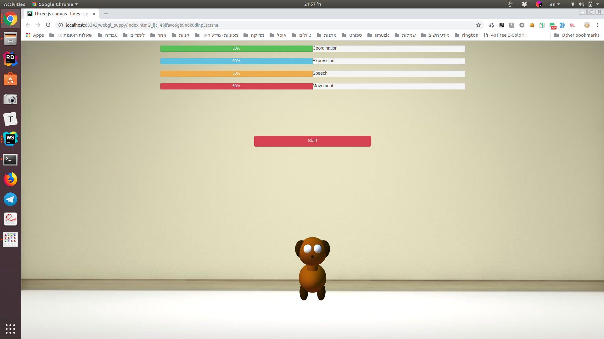
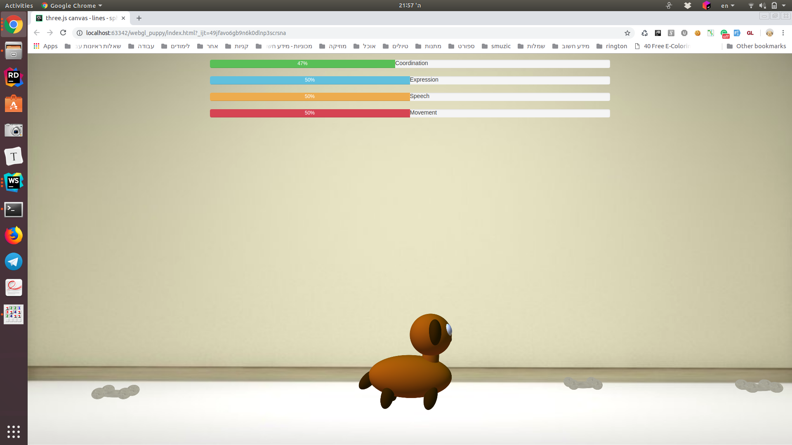

# webgl-puppy
Facebook Hackaton 2018 client-side. Puppy game in three.js webgl. Implements sentiment analysis data collection API. 

## user interface

## server 
https://github.com/roman-smirnov/sentiment

